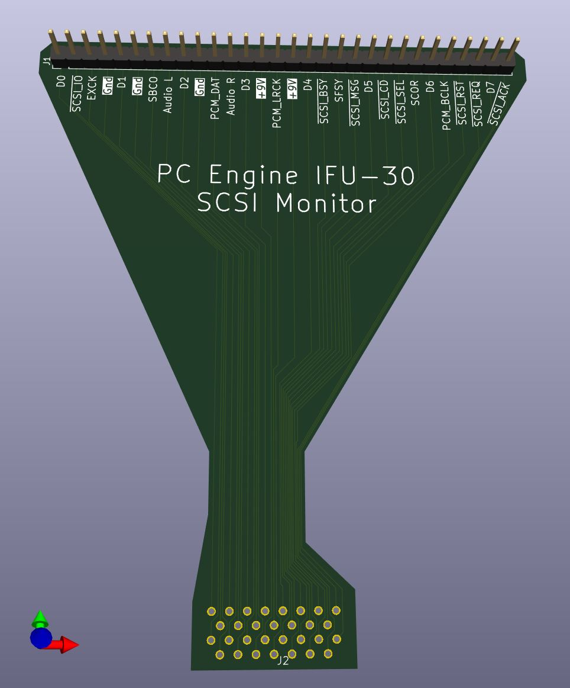
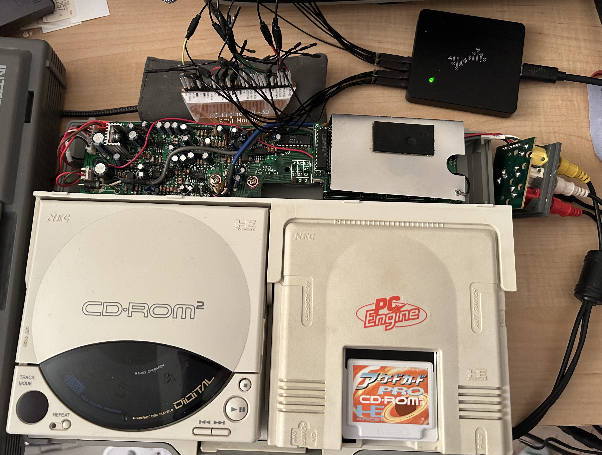

# PC Engine SCSI Logic Board

Flat Flex PC Board to assist in capturing SCSI signals from a PC Engine IFU-30 Interface Unit

## Introduction

The original PC Engine CDROM drive implemented a SCSI controller inside of it, and interfaced to the
IFU-30 Interface Unit via a 30-pin connector on it rear. There is a corresponding socket on the IFU-30
unit, soldered to a PC board which contains the remaining PC Engine hardware - memory, ADPCM controller,
ASIC, etc. - and likewise connects to the PC Engine.

This is a flat flex PC Board, designed to connect to the connector's through-hole pad on the PC board,
by sitting on top of the board, and extending those signals to the rear of the unit for easier access and
capture.

## The Design

This board was designed in KiCAD 9.0.1 ; design files and gerbers have been included in this repository,
for daring souls who may wish to repeat my experiments.

I ordered two thicknesses from JLCPCB - 0.11 mm and 0.20 mm - so that I could judge the differences in quality,
and I did not attempt to add a stiffener on either order.

0.11 mm was too fragile for this purpose, and 0.2 mm was also somewhat fragile (although workable). A stiffener
would have been very useful for the DIP header.

### Known Deficiencies

As I was in a hurry to build and tst this board and gain access to the signals, the board has a number of
areas I would like to change - but haven't yet done:

1. Traces are all on the top side, which comes into contact with the IFU-30 PC board, and could potentially
be scratched.  Traces should probably be on the bottom side.

2. Ground traces are all just as narrow as the signal traces. These should merge into a ground plane (or a
crosshatch, which is more common on flat flex boards), to provide better ground for the signals. There
seem to be glitches on several signals at times, and this may be because of the weak grounding.

3. There should probably be a second row of pins next to the inline header, to provide grounding for all signals,
to improve the signal fidelity.

4. Stiffeners should be specified for the inline header, in order to help reinforce it against the mechanical
stresses of soldering, and insertion and removal of signal cables on the inline header.

5. The holes on the CD connector are 0.8 mm centers, which are somewhat difficult to place on the pins
correctly, and also a bit fragile.  Slightly larger holes would probably be easier to work with. A stiffener
might also be helpful for this area (if possible), in order to ensure mechanical stability.

I'm sure there are more things which should be improved - this is why I don't suggest that the board be used
in its current design without modification.

### Installation Challenges

The current design has all of the signals on the top layer, which actually faces to the PC board (as it is
to be soldered to the underside).  The PC board has mant through-hole parts with sharp points protruding,
which could potentially cut through the coverlay (top covering) of the board, abd short (or damage) the traces.

For this reason, I used electrical tape on the PC board for the entire area where this board may come into
contact with it, to cover the sharp wires and help protect this board.

### Installed Photo of the Board

