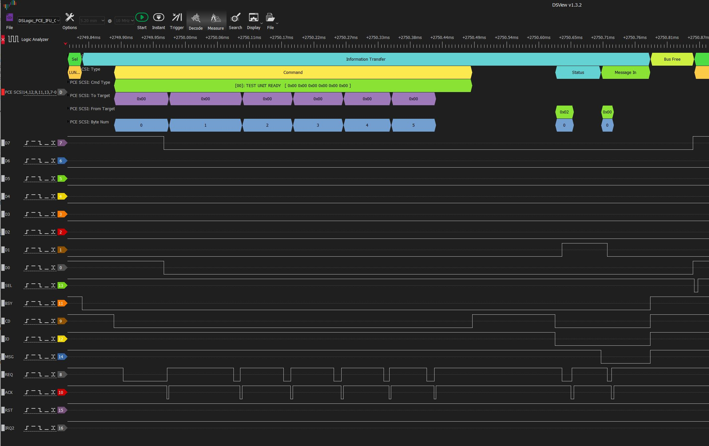

# pcengine_scsi_sigrok_protocol_decoder

Protocol decoder for sigrok/pulseview-based logic state analyzers for decoding SCSI data

## Introduction

The PC Engine uses SCSI to communicate to the internal CDROM (and potentially other devices).
This data can be seen travelling between the PC Engine IFU-30 Interface unit and the CDROM CDR-30 unit,
along with additional signals.

## The Protocol Decoder

### How To Install

On DSView, there is a folder called 'decoders' within the application folder for DSView; within this
folder are subfolders for each protocol decoder. Copy the 'pce-scsi' folder here into its corresponding
location in the application subfolder.  (For PulseView or other sigrok-compatible software, consult the
application's instructions).

### How To Use

Once you have installed the protocol decoder, it should be selectable in the list of protocol decoders.

**NOTE !
As there could be 40-60ns transients which could confuse the decoder, use a 10MHz sampling frequency, as there is a 1-sample
glitch suppressor in the code to remove glitches up to 100ns under these conditions.**

The protocol decoder adds several annotation rows, to be able to interpret the bitstream in several
different ways; each of them can be displayed or suppressed.  These rows include:
 - SCSI phase (which defines which unit(s) are communicating what type of data to each other)
 - Type (either LUN pairs for communication, or a communication type within "Information Transfer" bus phase)
 - Data To Target (data bytes being sent from the Master to the Target)
 - Data From Target (data bytes being sent from the Target to the Master)
 - Byte Number (Counter for bytes within a transfer sequence)

An example is shown below (from an actual data capture):

### Not Implemented

- SCSI Abort (i.e. transaction in progress)
- SCSI Reset
- Any Timing/timeout conditions (bus settling, timeouts, etc.)
- Any other Protocol Errors

### What exactly is this 'sigrok' thing ?

The sigrok project aims at creating a portable, cross-platform, Free/Libre/Open-Source signal analysis software suite that supports
various device types (e.g. logic analyzers, oscilloscopes, and many more).
(taken from [the project's home page](https://sigrok.org/wiki/Main_Page) )

The specification for protocol analyzers (for logic state analysis) is extensible and there are many
example protocols available.

### Why write a decoder ?

I had already done signal captures and understood the meanings of some state transitions of the signals for PC-FX SCSI,
but I needed to understand more about the SCSI standard, as implemented on the PC Engine.

## NOTES:

While this protocol decoder has been written according to sigrok standards, I have (so far) only
installed and tested on "DSView", used in conjunction with my DreamSource Labs' DSLogic U3Pro32
logic state analyzer, and not PulseView.

I have not yet submitted this into the sigrok project, as there are still some framing error
conditions I'd like to identify and display, and I want to do testing on the actual PulseView
software first.

I also may wish to do a little more code cleanup before submission.  I'm not familiar with their
review process, so I have no idea how long it will take to be approved (or receive feedback).

